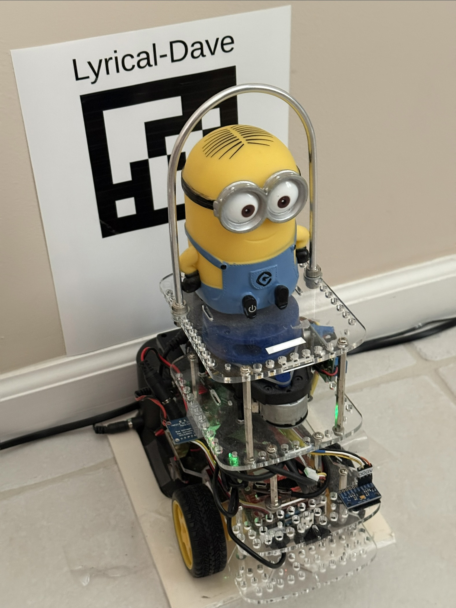

# LyricalDave  
Another re-incarnation of GoPiGo3 Robot Dave 
(with ROS 2 Lyrical Luth over Ubuntu 26.04 Resolute Raccoon)



- Ubuntu 26.04 Resolute Racoon 64-bit Server  

- Running on Raspberry Pi4 (4GB) 32GB uSDcard  

- OS Imaged: 5/27/26  

- GoPiGo3 Robot API - New Install Option A: 5/27/26  

- ROS 2 Lyrical Luth Base:  5/30/26

- Lyrical-Dave Awake: 2026-06

Versions of Dave:
- 2026-06: 5.0  Lyrical-Dave
- 2025-05  4.0  Kilted-Dave
- 2025-04  3.0  HumbleDave2
- 2024-03  2.0  GoPi5Go-Dave
- 2023-11  1.0  Humble-Dave
- 2021-06  0.2  ROSbot-Dave (ROS2 Foxy)
- 2019     0.1  ROS Kinetic (on Dave's hardware)

```
=== Code and Documentation Lines in /home/ubuntu/LyricalDave on 2026-06-04 ===
*.py: 21689
*.cpp: 108
*.sh: 2814
*.md: 2176
*.txt: 754
*.yaml: 3972
Total Lines: 21689
```
